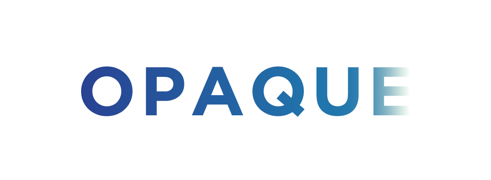

# opaque-ea

This project is a proof-of-concept implementation
of [OPAQUE with Exported Authenticators](https://tools.ietf.org/html/draft-sullivan-tls-opaque-00), written in Go.

You can play with the demo at [https://opaque.research.cloudflare.com/](https://opaque.research.cloudflare.com/).

**DISCLAIMER**: This is a reference implementation only.
*DO NOT* use in production systems.

## Getting started

Get the source code:

```sh
git clone https://github.com/cloudflare/opaque-ea
```

## Running tests

From the `opaque-ea` folder, run all tests:

```sh
make test
```

## Run a test client and server

Spin up a local server:

```sh
  # Set PUBLIC_PATH to path of public folder
  export PUBLIC_PATH="public/"
  # Build the server
  cd https-server && go build main.go && cd ..
  # Build the client
  cd public/go && GOOS=js GOARCH=wasm go build -o ../main.wasm && cd ../..
  # Start local server
  ./https-server/main
```

View the result locally at [http://localhost:8080/](http://localhost:8080/).

### Making changes to client

If you make any changes to the client code, you need to re-compile
Go to Wasm to see them in your browser.

From the `opaque-ea` folder:

```sh
# Compile go to wasm
cd public/go && GOOS=js GOARCH=wasm go build -o ../main.wasm && cd ../..
```

## Packages

### Library packages

|   |   | |
|---|---|---|
|  src/expauth    |  TLS Exported Authenticators            | Partially implements https://datatracker.ietf.org/doc/html/draft-ietf-tls-exported-authenticator-13 |
|  src/opaque     |  OPAQUE core (no key exchange)          | Partially implements https://tools.ietf.org/html/draft-krawczyk-cfrg-opaque-06 |
|  src/opaqueea   |  OPAQUE with Exported Authenticators    | Partially implements https://tools.ietf.org/html/draft-sullivan-tls-opaque-00 |
|  src/ohttp      | OPAQUE-EA over HTTPS, client and server | |

### Executable packages

|   |   |
|---|---|
|  public/go    |  Wrapper for HTTPS client, compiles to Wasm  |
|  https-server |  Wrapper for HTTPS server, compiles to Go executable    |

## License

The project is licensed under the [BSD-3-Clause License](LICENSE).
